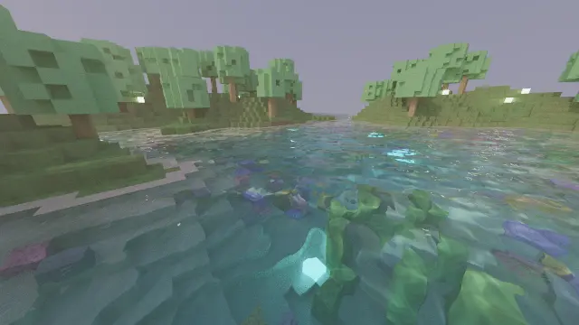

# Path Tracer

[](https://github.com/jferguson-tech/ray-tracer-simd/actions/workflows/build.yml)

High-performance C++ path tracer with SIMD acceleration.



*The scripted dive `demo_underwater.json`, rendered offline at 1280x720 with 256
samples per pixel and shown at 30 fps. [pathtracer.mp4](pathtracer.mp4) is the
same clip as a video file.*

## Features
- AVX2 SIMD acceleration: measured 1.9-2.2x whole-frame speedup (3-5x in the vectorized subsystems)
- 8-wide packet ray marching for volumetric shadow rays, vectorized caustic-map and noise kernels, SSE-backed Vec3
- Multi-threaded tile renderer (std::thread)
- 512 x 512 block voxel world with procedurally textured terrain, refractive and reflective water, and emissive light blocks
- Sun and sky lighting and volumetric light shafts, above and below the water
- Underwater: a caustic light network that reaches the lake bed at any depth, water that turns
  from turquoise to blue with depth and distance, light shafts, drifting particles, and the sky
  seen through the rippling surface from below
- Lake beds with rocks, coral, kelp and glowing sea lanterns
- Light blocks are sampled directly, so lamp-lit areas converge quickly
- Camera path recording, playback, benchmarking and offline rendering (JSON)
- Denoiser: an edge-stopping wavelet filter guided by each pixel's surface, so the window shows a
  clean image from 2 samples per pixel
- Repeatable renders: the same command produces the same image, on any number of threads

## Performance

Measured at 128 samples/pixel, offline mode, AMD Ryzen AI 9 HX 370 (12C/24T, MSVC /O2 /arch:AVX2):

| View | Resolution | Scalar | SIMD | Speedup |
|---|---|---|---|---|
| Lake | 640x360 | 26.3 s | 14.2 s | 1.85x |
| Lake | 1280x720 | 104.8 s | 55.0 s | 1.90x |
| River valley | 640x360 | 40.4 s | 18.1 s | 2.23x |
| River valley | 1280x720 | 160.6 s | 71.6 s | 2.24x |

Output is identical to the scalar renderer within path-tracing noise (~47 dB PSNR
against a scalar reference, at the run-to-run noise floor).

## Build & Run

### Windows (Visual Studio)
```bat
build_windows.bat          :: build pathtracer.exe
build_windows.bat run      :: build, then start the interactive viewer
```
Needs Visual Studio 2019 or 2022 with "Desktop development with C++". The script
finds the compiler itself, and on the first run downloads the official SDL2
development package into `third_party/` (checksum verified).

### Linux
```bash
g++ -O3 -mavx2 -pthread -std=c++17 trace.cpp -o pathtracer -lSDL2
./pathtracer
```

## Command-Line Options
```bash
./pathtracer                         # interactive viewer
./pathtracer demo.json --play        # play a recorded camera path in the window
./pathtracer demo_underwater.json --play   # a scripted dive through the central lake
./pathtracer --bench                 # fixed benchmark: seven views, timings and images
./pathtracer --benchmark             # play demo.json in real time and write benchmark_results.json
./pathtracer --offline --samples 128 --resolution 5   # render demo.json to output/frame_NNNNN.png
./pathtracer --offline --start-frame 250              # continue a stopped render at frame 250
./pathtracer --help
```

| Option | Meaning |
|---|---|
| `demo.json` or `--demo <file>` | Camera path file to load (default `demo.json`). This is a camera path, not a scene: the world is generated from a seed. |
| `--play` | Play the camera path in the window |
| `--bench` | Fixed benchmark (see below), without a window |
| `--benchmark` | Play the camera path in real time and write `benchmark_results.json` |
| `--offline` | Render the camera path to `output/` as PNG at 30 frames per second, without a window |
| `--start-frame <n>` | With `--offline`: begin at frame `n` instead of 0, to continue a render that was stopped |
| `--samples <n>` | Samples per pixel: offline frames (default 1000), `--bench` (default 32) |
| `--resolution <1-6>` | 144p, 240p, 360p (default), 480p, 720p, 1080p |
| `--threads <n>` | Render threads (default: all) |
| `--seed <n>` | World seed (default 42) |
| `--time <0-1>` | Time of day (default 0.85; 0.5 is midday) |
| `--caustic-quality <1-3>` | Caustic map detail: 2, 4 or 8 texels per block (default 2; offline renders use 3) |
| `--caustic-strength <x>` | Contrast of the caustic pattern (default 1; 0 gives even light) |
| `--shaft-strength <x>` | Brightness of underwater light shafts (default 1) |
| `--no-particles` | No drifting specks in the water |
| `--denoise`, `--no-denoise` | Denoiser on or off (default: on in the window, off for `--offline`, `--bench` and `--benchmark`) |
| `--temporal`, `--no-temporal` | The denoiser also reuses the previous view's samples (default: on in the window). With `--offline --denoise`, a frame then depends on the frames rendered before it |
| `--dump-caustics` | Write the caustic map's layers to `output/` as images and exit |
| `--no-caustics`, `--no-volumetrics` | Turn an effect off |
| `--no-lamp-sampling` | Find light blocks by bounces only (slower to converge; for comparison) |

### Fixed benchmark
`--bench` renders seven fixed views (lake, shore, underwater reef, lake bed,
aerial, deep water, looking up at the surface) at a fixed sample count and prints the time, rays per second and samples per second
for each. It writes the images to `output/bench_<view>.png` and the numbers to
`benchmark_fixed.json`. The views, sample count and random sequences are the same
on every machine, so results compare across builds and computers. (`--benchmark`
plays a camera path in real time, so what it renders depends on the machine's
speed.)

```bash
./pathtracer --bench                              # 360p, 32 samples per pixel
./pathtracer --bench --samples 128 --resolution 5 # 720p, 128 samples per pixel
```

Measured with `--bench` (640x360, 32 samples per pixel) on an AMD Ryzen 9 7950X
(16C/32T, Linux, g++ 13.3 -O3 -mavx2):

| View | Time (s) | Mrays/s |
|---|---|---|
| lake | 0.46 | 459 |
| shore | 0.42 | 536 |
| underwater | 0.56 | 371 |
| lakebed | 0.53 | 535 |
| aerial | 0.41 | 504 |
| deep | 0.58 | 342 |
| lookup | 0.57 | 438 |
| total | 3.53 | 448 |

Renders are repeatable: random numbers are seeded per pixel, pass and frame, so
the same command gives a byte-identical image on any number of threads. To check
a change against a previous build, keep the old images and compare:

```bash
python compare_images.py output_before output      # PSNR and difference per view
```

Every pull request is also checked for this: the CI renders two offline frames and
the seven `--bench` views (plain and denoised) and compares their SHA-256 with the
lists in `tests/`. Linux and Windows each have their own list, because the two
compilers' math libraries round a few functions differently; on one platform the
images are the same on every run.

### Denoiser
The window is denoised by default (`N` toggles it); `--denoise` does the same for
`--offline` and `--bench` images. The filter never changes the samples themselves,
only how they are combined into the picture, and it fades out as samples
accumulate, so a long render converges to the same image with or without it.

PSNR of the seven `--bench` views against a 1024 samples per pixel reference
(640x360, lowest and highest view):

| Samples per pixel | As rendered | Denoised |
|---|---|---|
| 2 | 23.3 - 33.0 dB | 27.1 - 38.6 dB |
| 8 | 28.9 - 38.4 dB | 32.0 - 43.0 dB |
| 32 | 34.9 - 44.2 dB | 36.6 - 47.0 dB |

While the camera moves, the denoiser also reuses the previous view (`H` toggles
it, `--temporal` turns it on for `--offline --denoise`): each pixel's surface
point is looked up in the previous image and, where the same surface was
visible there, its light is mixed in before the filter runs. Measured on frames
of `demo_underwater.json` at 640x360, 2 samples per pixel, against 512 samples
per pixel:

| Frame | As rendered | Denoised | Denoised, with the previous view |
|---|---|---|---|
| 24 (above the lake) | 24.5 dB | 30.1 dB | 33.0 dB |
| 314 (on the lake bed) | 25.3 dB | 33.6 dB | 35.4 dB |
| 614 (looking up at the surface) | 32.1 dB | 36.9 dB | 37.0 dB |

The filter takes about 17 ms at 640x360 and 60 ms at 1280x720 on an AMD Ryzen 9
7950X (32 threads).

### Controls (interactive)
| Keys | Action |
|---|---|
| `W` `A` `S` `D`, `Space`, `Shift`, mouse | Move and look |
| `1` to `6` | Render resolution |
| `Q` / `E` | Window size |
| `R` / `F` | New random world / next seed |
| `T` / `G` | Time of day |
| `F1` | Start or stop recording a camera path |
| `F2` / `F3` | Play the path / benchmark it |
| `F5` / `F6` | Save / load the path |
| Keypad `1` `2` `3` | Toggle caustics, toggle volumetrics, caustic map detail |
| `N` | Toggle the denoiser |
| `H` | Toggle the denoiser's reuse of the previous view |
| `Esc` | Quit |

The water animates while the view is changing and holds still while a still
view accumulates samples, so the image converges. In offline renders the water
follows each frame's time, so its speed does not depend on `--samples`.

### Video Creation
```bash
# Basic video creation (uses output/ directory)
python create_video.py

# Specify custom input/output
python create_video.py -i output -o my_render.mp4

# Adjust frame rate
python create_video.py --fps 60

# Use specific number of CPU cores
python create_video.py -w 8

# Benchmark PPM readers (frames from older builds)
python create_video.py --benchmark
```
Offline frames are PNG; the script also reads the PPM frames older builds wrote.

## Technical Highlights
- Custom Vec3 backed by SSE registers; 8-wide AVX2 sin/cos/exp kernels (no FMA required)
- Caustic-map refraction, volumetric scattering and value-noise textures vectorized 8-wide
- Volumetric shadow rays marched as 8-wide SIMD packets through the voxel DDA
- Effects run at full quality on what the camera sees (directly or through water) and with
  one random sample on indirect bounces; rays rising above the highest block stop early
- Sun horizon: once per frame, each row of the world is swept from its far end to find, per
  column, the height above which a ray toward the sun cannot hit anything. Those cells are
  flagged in a copy of the grid, so sun shadow rays stop at the first flagged cell instead of
  marching to the top of the world. The result is exactly what the full march returns
- Sun bands: a ray toward the sun stays in one vertical slice of the world, where it is a
  straight line. The lines through a cell are sorted into narrow bands, and for each cell
  and band a sweep from the sun's end of the slice records how every ray of that band can
  end: in the open, in leaves or in another block. Where only one ending is possible, a
  light-shaft sample or a surface reads its shadow from the table (two bits) instead of
  marching; where a band's edges split around a block, the ray is marched as before, so
  the picture is byte-identical. The table settles about 99% of the points in open cells
  (fewer with the sun almost overhead) and is rebuilt in 15 to 30 ms when the sun moves
- Open sky: the world's columns are grouped in tiles of 4 x 4 with the height above which
  each tile is empty. A rising ray is first walked over the tiles; if it stays above every
  one it crosses it ends there, without a march through the cells
- Indirect bounces evaluate their one light-shaft step in a short path of its own, and the
  specks drifting in the water are worked out once per block and thread instead of per ray
- The twelve light-shaft samples of a camera ray are set up eight at a time: positions,
  the sun band lookup and, under water, the absorption and the caustic map
- Persistent worker threads for render passes, image conversion and the caustic map; the
  8-bit image is only produced when it is shown or saved
- Lighting above water: direct sun, light blocks sampled directly (combined with bounce hits by
  multiple importance sampling) and one cosine-weighted bounce that gathers sky and surface light
- Water surface: a sum of eight waves in different directions (5-block swells down to
  half-block ripples). Fresnel reflection and refraction from both sides, split on camera rays
  and chosen by probability on indirect paths; from below, total internal reflection leaves a
  window to the sky surrounded by a mirror of the lake bed
- Caustic map: once per frame, a grid of light samples is refracted through the waves and
  collected in one layer per block of depth (built on all threads). It covers the 160 blocks
  around the camera, so its cost does not depend on the size of the world; the pattern fades
  to even light between 56 and 72 blocks away. Any
  underwater point then reads its light with a few texture lookups: no noise, at any depth,
  with slight color fringes because blue bends more than red. `--dump-caustics` shows the layers
- Water as a medium: every ray segment in water loses light per color (red first) and gains
  the water's own glow, so depth and distance shift everything toward blue. Underwater light
  shafts and drifting particles are lit through the caustic map, and blocks in or above the
  water cast shadows into it. Sunlight under water is shown about three times brighter than
  it physically is (an artistic gain, as if the eye had adapted)
- Denoiser: an a-trous wavelet filter (five rounds of 5 x 5 taps, spread twice as far each
  round). Each pixel records the surface it shows, followed through the water's refraction or
  reflection. The image is divided by that surface's color, so textures stay sharp and only
  the light is filtered; neighbors count less when they are off the pixel's surface plane,
  face another way, or differ in brightness by more than the variance of the pixel's own
  samples explains
- Temporal reuse: when the view changes, each pixel's surface point is projected into the
  previous camera and the light stored there is mixed in if it shows the same surface (same
  face, on its plane; through water, the apparent position along the camera ray is compared).
  The previous view counts for at most 4 samples, because haze and the water's glow depend
  on the viewpoint; the water surface seen from below is not reused
- Trees, lights and lake decoration (rocks, coral, kelp, sea lanterns) are placed by an integer
  hash of the column, so they are the same on every platform and at any world size; sea
  lanterns are light blocks and are sampled directly
- Voxel grid traversal (3D DDA); rays that start outside the world are clipped to it

## Requirements
```bash
# For video generation and compare_images.py
pip install -r requirements.txt
```


## License
MIT
